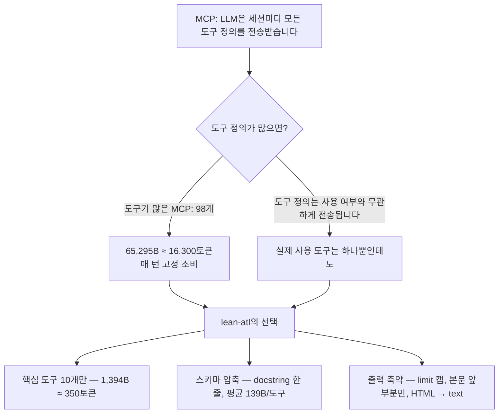

<p align="right">
  <a href="README.md">English</a> | <strong>한국어</strong>
</p>

# lean-atl

<p align="center"><strong>10 tools. 1.4KB. 98% fewer tokens.</strong></p>

<p align="center">
  
  
</p>

가벼운 **읽기전용** 로컬 Jira/Confluence MCP 서버입니다.
클라우드와 서버/데이터센터(Data Center) 배포를 모두 지원합니다.
도구 10개, 도구 정의 스키마 1.4KB — 세션당 약 350토큰만 전송합니다.

**목차:** [왜 lean-atl인가](#왜-lean-atl인가) · [왜 가벼운가](#왜-가벼운가) · [설치 및 실행](#설치-및-실행) · [환경변수](#환경변수) · [도구 목록](#도구-목록-10개) · [보안 설계](#보안-설계) · [테스트](#테스트-실-api-키-없이)

## 왜 lean-atl인가

비개발자(마케터, 디자이너, 기획자)는 지라·컨플루언스에서 이슈나 페이지를
생성하기보다 **탐색만** 필요한 경우가 많습니다. 그런데 클로드의 토큰 비용은
계속 증가하고, 도구가 많은 MCP는 토큰 소모가 큽니다. 쓰기/읽기를 모두
제공하는 서버라면 어쩔 수 없는 부분이지만, 조회를 월 10~15번만 해도 회사
할당량을 거의 소모해 버리는 상황이 쉽게 발생합니다. 탐색은 그보다 훨씬
빈번한데, 탐색을 읽기 전용으로만 처리해 토큰량을 줄일 방법을 모색하다가
이 프로젝트를 시작했습니다.



## 왜 가벼운가

MCP에서 LLM은 **세션마다 모든 도구 정의 스키마를 다시 전송**받습니다. 도구
수와 스키마 크기가 곧 토큰 비용입니다. lean-atl은 이 고정 비용을 설계로
최소화합니다.

| 구성 | 도구 수 | 스키마 전체 | ≈ 토큰 |
|---|---:|---:|---:|
| **lean-atl** | **10** | **1,394 B** | **~350** |
| 도구가 많은 MCP (기본 구성) | 98 | 65,295 B | ~16,300 |
| 도구가 많은 MCP (TOOLSETS=default) | 35 | 32,177 B | ~8,000 |
| 도구가 많은 MCP (ENABLED_TOOLS 4종) | 5 | 7,292 B | ~1,800 |

같은 API·인증 방식을 쓰는 서버 기준으로, 기본 구성 대비 **스키마 98% 감소
(세션당 약 16,000토큰 절약)**. 최소 구성(5개 도구)으로 줄여도 lean-atl의
10개 도구가 더 가볍습니다 (스키마 평균 139B vs 1,458B).

### 토큰 절약 설계 원칙
1. **도구 10개** — 실제 쓰는 핵심만 (검색/조회/댓글/목록)
2. **docstring 한 줄, 파라미터 설명 최소** — 스키마 평균 139B
3. **결과 축약** — 목록은 `limit` 캡 (기본 20, 최대 100), 본문은 `max_chars`로 서버에서 잘라 줍니다
4. **Confluence HTML → plain text 변환** — script/style을 통째로 제거해 원본 HTML의 불필요한 토큰 소비와 스크립트 텍스트 유입을 막습니다
5. **Jira REST `fields=` 명시** — 응답 자체를 작게 유지합니다

### 토큰을 줄이는 다른 접근과의 차이

토큰을 줄이는 또 다른 접근으로, 기존 MCP 서버를 감싸서 도구 설명을
압축하는 프록시 방식([atlassian-labs/mcp-compressor](https://github.com/atlassian-labs/mcp-compressor) 등)이
있다. lean-atl은 기존 서버를 압축하는 대신 **서버 자체를 처음부터 가볍게
설계**한다는 점에서 다르다.

| | 압축 프록시 방식 | lean-atl |
|---|---|---|
| 방식 | 기존 서버 앞에 프록시를 끼워 설명을 압축 | 서버를 처음부터 가볍게 설계 |
| 도구 수 | 그대로 (설명만 압축) | 핵심 10개만 |
| 구성 | 프록시 계층 추가 필요 | 서버 1개 |
| 도구 설명 | 압축 레벨이 높으면 LLM이 도구를 이해하기 어려울 수 있음 | 10개 도구에 충분한 설명 유지 |

압축 프록시가 도구가 많은 서버(94개)를 가장 강하게 압축하면 약 500토큰까지
줄어들지만, lean-atl은 10개 도구로 348토큰이면서 각 도구의 설명을 유지한다.

## 설치 및 실행

### macOS

```bash
# 0) uv 설치 (없을 때만)
brew install uv
# 1) lean-atl 저장소 내려받기
git clone https://github.com/sayho87/lean-atl.git
cd lean-atl
# 2) 가상환경 생성 (uv가 Python 3.12를 자동으로 준비)
uv venv .venv
# 3) 의존성 설치
uv pip install --python .venv/bin/python fastmcp httpx
```

### Windows (PowerShell)

```powershell
# 0) uv 설치 (없을 때만)
winget install --id=astral-sh.uv
# 1) lean-atl 저장소 내려받기
git clone https://github.com/sayho87/lean-atl.git
cd lean-atl
# 2) 가상환경 생성 (uv가 Python 3.12를 자동으로 준비)
uv venv .venv
# 3) 의존성 설치 (Windows는 Scripts 경로)
uv pip install --python .venv\Scripts\python.exe fastmcp httpx
```

> uv가 없는 환경이라면 공식 설치 스크립트를 써도 됩니다:
> `powershell -ExecutionPolicy ByPass -c "irm https://astral.sh/uv/install.ps1 | iex"`

### 비개발자를 위한 설치 (AI 어시스턴트 활용)

개발 환경이 익숙하지 않아도, AI 코딩 어시스턴트(안티그래비티 등)에게
아래처럼 말하면 설치를 대신 진행해 줍니다.

**1. AI 어시스턴트를 엽니다**

안티그래비티가 없다면 터미널에서 `brew install --cask antigravity-cli`로
설치하고 실행합니다.

**2. 아래 문장을 복사해서 붙여넣습니다**

> 이 깃헙 링크를 설치해줘: https://github.com/sayho87/lean-atl
> 설치 과정에서 Personal Access Token처럼 내가 직접 입력해야 하는 부분은
> **** 로 표시해주고, 어디에 입력해야 하는지 알려줘. 나머지는 네가 알아서 진행해줘.

**3. AI가 알려준 부분만 직접 입력합니다**

AI가 "**** 여기에 입력하세요"라고 안내한 자리에 PAT를 직접 붙여넣습니다.
PAT는 Confluence(또는 Jira)에 로그인한 상태에서 **사용자 프로필 →
Personal Access Token** 메뉴에서 발급받습니다.

**4. 동작을 확인합니다**

설치가 끝나면 "lean-atl로 Confluence 문서를 검색해봐"라고 입력해서
실제로 동작하는지 확인합니다.

## 환경변수

기존 MCP 설정과 동일한 변수명을 사용하므로, 다른 도구에서 쓰던 설정을
그대로 옮겨 쓸 수 있습니다.

**Jira Cloud:**
| 변수 | 설명 |
|---|---|
| `JIRA_URL` | 예: `https://your-domain.atlassian.net` |
| `JIRA_USERNAME` | 계정 이메일 |
| `JIRA_API_TOKEN` | https://id.atlassian.com/manage-profile/security/api-tokens |

**Confluence Cloud:**
| 변수 | 설명 |
|---|---|
| `CONFLUENCE_URL` | 예: `https://your-domain.atlassian.net/wiki` |
| `CONFLUENCE_USERNAME` | 계정 이메일 |
| `CONFLUENCE_API_TOKEN` | API 토큰 |

**Server/Data Center (PAT 사용 시):**
| 변수 | 설명 |
|---|---|
| `JIRA_URL` / `CONFLUENCE_URL` | 자체 호스팅 주소 |
| `JIRA_PERSONAL_TOKEN` / `CONFLUENCE_PERSONAL_TOKEN` | PAT (Bearer 인증, Jira는 REST v2 자동 전환) |
| `JIRA_SSL_VERIFY` / `CONFLUENCE_SSL_VERIFY` | `false` 시 SSL 검증 해제 (기본 `true`) |

**보안 (mTLS / 키 검증):**
| 변수 | 설명 |
|---|---|
| `JIRA_CLIENT_CERT` / `CONFLUENCE_CLIENT_CERT` | mTLS 클라이언트 인증서 PEM 경로 (결합 or 인증서만) |
| `JIRA_CLIENT_KEY` / `CONFLUENCE_CLIENT_KEY` | 개인키가 분리된 경우 PEM 경로 |
| `JIRA_ISSUE_KEY_PATTERN` | 이슈키 허용 정규식 (기본 `^[A-Z][A-Z0-9_]+-\d+(?:-\d+)*$`) |

**공통:**
| 변수 | 설명 |
|---|---|
| `CONFLUENCE_SPACES_FILTER` | 허용 스페이스만 (콤마 구분, 예: `DEV,PM`) |
| `JIRA_PROJECTS_FILTER` | 허용 프로젝트만 (콤마 구분, 예: `PROJ,TEST`) |
| `LEAN_MAX_RESULTS` | 목록 기본 캡 (기본 20, 명시 시 최대 100) |
| `LEAN_BODY_CHARS` | 본문 기본 캡 (기본 8000) |

**하위호환**: `ATLASSIAN_SITE_URL` / `ATLASSIAN_USER_EMAIL` / `ATLASSIAN_API_TOKEN`이
있으면 Jira·Confluence 공용으로 사용합니다 (`JIRA_*`/`CONFLUENCE_*`가 우선).
인증은 `*_PERSONAL_TOKEN`이 있으면 Bearer(PAT), 없으면 Basic(Cloud API Token)으로
자동 판별합니다.

### 클라이언트 설정 예시 (Claude Desktop / Cursor)

```json
{
  "mcpServers": {
    "lean-atl": {
      "command": "/Users/howoomac/Projects/lean-atl/.venv/bin/python",
      "args": ["/Users/howoomac/Projects/lean-atl/lean_atl.py"],
      "env": {
        "JIRA_URL": "https://your-domain.atlassian.net",
        "JIRA_USERNAME": "you@company.com",
        "JIRA_API_TOKEN": "your_token",
        "CONFLUENCE_URL": "https://your-domain.atlassian.net/wiki",
        "CONFLUENCE_USERNAME": "you@company.com",
        "CONFLUENCE_API_TOKEN": "your_token",
        "CONFLUENCE_SPACES_FILTER": "DEV,PM",
        "JIRA_PROJECTS_FILTER": "PROJ"
      }
    }
  }
}
```

Server/DC(PAT)를 쓴다면 `JIRA_PERSONAL_TOKEN`·`CONFLUENCE_PERSONAL_TOKEN`만
채우고 `JIRA_SSL_VERIFY=false` 등을 추가하면 됩니다.

> Windows라면 `command` 경로를 `.venv\Scripts\python.exe`로 바꿉니다
> (예: `C:\Users\you\Projects\lean-atl\.venv\Scripts\python.exe`).

## 도구 목록 (10개)

| 도구 | 설명 |
|---|---|
| `jira_search` | JQL 검색 (핵심 필드만) |
| `jira_get` | 이슈 상세 (설명/댓글 앞부분만) |
| `jira_my_tasks` | 내 미해결 이슈 |
| `jira_projects` | 프로젝트 목록 |
| `confluence_search` | CQL 검색 (`include_snippet` 옵션으로 본문 200자 미리보기) |
| `confluence_get` | 페이지 본문 (text, max_chars로 앞부분만) |
| `confluence_get_children` | 하위 페이지 목록 |
| `confluence_get_comments` | 페이지 댓글 목록 (본문 앞부분만) |
| `confluence_space_tree` | 스페이스 페이지 트리 (max_depth, 제목만) |
| `confluence_spaces` | 스페이스 목록 |

### 문서 탐색 순서 예시
1. `confluence_spaces` → 어떤 스페이스가 있는지
2. `confluence_space_tree(space_key, max_depth=5)` → 스페이스 구조 파악
3. `confluence_search(cql, include_snippet=True)` → 원하는 문서 검색 (스니펫으로 판별)
4. `confluence_get(id)` → 문서 본문 읽기
5. `confluence_get_children(id)` → 하위 문서로 이어서 읽기

## 보안 설계

**쓰기 도구를 배제한 읽기 전용 서버 — 잘못된 호출이 데이터를 바꿀 수 없습니다.**

- **읽기 전용** — 생성/수정/삭제/전이/첨부 도구가 없어, LLM이 잘못된 도구를 호출해도 데이터를 변경할 수 없습니다. 서버 시작 시 "읽기 전용 서버 (쓰기 도구 0개)"를 로그로 알립니다
- **스코프 필터는 강제 경계** — `JIRA_PROJECTS_FILTER`는 JQL에 AND, `CONFLUENCE_SPACES_FILTER`는 CQL에 AND로 붙습니다. 단건 조회(`jira_get`, `confluence_get` 등)도 허용 범위 밖이면 API 호출 전에 거절합니다
- **경로 조작 차단** — 컨플루언스 `id`는 숫자만, 스페이스 키는 영문·숫자·밑줄만 받습니다. `../../admin` 같은 입력은 URL에 붙이기 전에 거절합니다
- **출력 한도 강제** — `limit`/`max_chars`는 `LEAN_MAX_RESULTS`/`LEAN_BODY_CHARS` 상한으로 자르고 음수는 차단합니다
- **이슈키 형식 검증** — `JIRA_ISSUE_KEY_PATTERN` 정규식으로 API 호출 전에 검증합니다
- **mTLS 지원** — `JIRA_CLIENT_CERT`(+`KEY`) / `CONFLUENCE_CLIENT_CERT`(+`KEY`)를 지원합니다
- **토큰 노출 경로 없음** — 토큰은 env에서 Authorization 헤더로만 사용합니다 (grep 검증 완료)
- **리다이렉트 미허용** — 자격증명이 다른 호스트로 전송될 경로가 없습니다
- **의존성 2개** (fastmcp, httpx)
- **stdio 전용** — 네트워크 리스닝이 없습니다

**사용자 유의사항:**
- HTTPS가 아니면 평문 전송 — 반드시 `https://` URL을 사용하세요 (http://로 설정하면 시작 로그에서 경고가 출력됩니다)
- `*_SSL_VERIFY=false`는 MITM 위험 — 자체 서명 인증서가 아니면 끄지 마세요
- 필터는 검색 질의와 단건 조회를 막지만, 최종 권한 통제는 Atlassian 측 프로젝트/스페이스 권한입니다
- OAuth 2.0 / 프록시 헤더 인증은 HTTP 배포(멀티 사용자) 전용이라 stdio 로컬에선 지원하지 않습니다

## 테스트 (실 API 키 없이)

```bash
.venv/bin/python tests/mock_atlassian.py &   # 모의 서버 (127.0.0.1:8765)
.venv/bin/python tests/test_client.py        # 10개 도구 프로토콜 통합 테스트
.venv/bin/python tests/test_filters.py       # 스코프 필터 강제 검증
.venv/bin/python tests/test_security.py      # 경로 조작·한도·mTLS 검증
.venv/bin/python tests/test_pat.py           # Server/DC PAT 모드 검증
.venv/bin/python tests/measure_schema.py     # 스키마 크기 벤치마크
```
