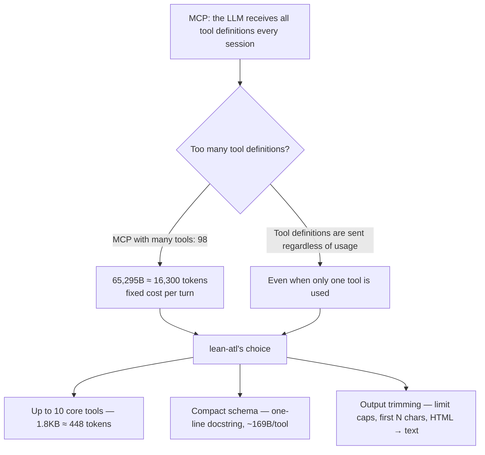

<p align="right">
  <strong>English</strong> | <a href="README.ko.md">한국어</a>
</p>

# lean-atl

<p align="center"><strong>Up to 10 tools. 1.8KB tool schema. Up to 98% fewer tool-definition tokens.</strong></p>

<p align="center">
  
  
</p>

A lightweight **read-only** local Jira/Confluence MCP server.
Supports both Cloud and Server/Data Center deployments.
Up to 10 tools with a 1.8KB tool-definition schema — only ~448 tokens of tool definitions per request.
If you use Confluence only (no JIRA_URL), 4 Jira tools are omitted automatically:
6 tools / 1.2KB / ~304 tokens of tool definitions — 98% fewer than a full MCP server.
Tool definitions are sent once per request; session bills are also driven by content read, output, and prompt caching.

**Contents:** [Why lean-atl](#why-lean-atl) · [Why it is light](#why-it-is-light) · [Installation](#installation) · [Environment variables](#environment-variables) · [Tools](#tools-10) · [Security design](#security-design) · [Testing](#testing-without-real-api-keys)

## Why lean-atl

Non-developers (marketers, designers, product managers) more often need to
**explore** Jira/Confluence than to create issues or pages. Token costs keep
rising, and MCP servers with many tools consume a lot of tokens. A server that
provides both write and read capabilities naturally carries that cost — a mere
10–15 lookups a month can nearly exhaust a company's allocation. Exploration
happens far more often than that, so this project started as a search for a way
to make exploration read-only and cut token usage.



## Why it is light

In MCP, the LLM **receives all tool definition schemas again every session**.
Tool count and schema size directly become token cost. lean-atl minimizes this
fixed cost by design.

| Configuration | Tools | Schema total | ≈ tokens |
|---|---:|---:|---:|
| **lean-atl** | **10** | **1,694 B** | **~423** |
| MCP with many tools (default) | 98 | 65,295 B | ~16,300 |
| MCP with many tools (TOOLSETS=default) | 35 | 32,177 B | ~8,000 |
| MCP with many tools (ENABLED_TOOLS, 4) | 5 | 7,292 B | ~1,800 |

Using the same API and auth, this is a **97% schema reduction (≈15,900 tokens
saved per session)** compared with the default configuration. Even reduced to a
minimal configuration (5 tools), lean-atl's 10 tools are lighter — 169B vs
1,458B average per tool.

### Token-saving design principles
1. **10 tools** — only the essentials (search / view / comments / lists)
2. **One-line docstrings, minimal parameter descriptions** — ~169B avg per tool
3. **Trimmed results** — lists capped by `limit` (default 20, up to 100), bodies by `max_chars`
4. **Confluence HTML → plain text** — strips `script`/`style` blocks entirely, avoiding unnecessary token consumption and script text leaking into context
5. **Jira REST `fields=`** — keeps responses small

### How this differs from compressing an existing server

Another approach to saving tokens is a proxy that wraps an existing MCP server
and compresses its tool descriptions (e.g.
[atlassian-labs/mcp-compressor](https://github.com/atlassian-labs/mcp-compressor)).
lean-atl takes a different path: instead of compressing an existing server, it
**designs the server to be light from the start**.

| | Compression proxy | lean-atl |
|---|---|---|
| Approach | Wrap an existing server, compress descriptions | Light by design from the start |
| Tool count | Unchanged (descriptions only are compressed) | Only 10 core tools |
| Setup | Requires an extra proxy layer | A single server |
| Tool descriptions | High compression can make tools hard for the LLM to understand | Full descriptions kept for 10 tools |

A compression proxy can push a server with many tools (94) down to ~500 tokens
at its most aggressive level, while lean-atl uses 448 tokens for 10 tools and
keeps each tool's description intact.

## Installation

### macOS

```bash
# 0) Install uv (only if missing)
brew install uv
# 1) Clone the repository
git clone https://github.com/sayho87/lean-atl.git
cd lean-atl
# 2) Create a virtualenv (uv prepares Python 3.12 automatically)
uv venv .venv
# 3) Install dependencies
uv pip install --python .venv/bin/python fastmcp httpx
```

### Windows (PowerShell)

```powershell
# 0) Install uv (only if missing)
winget install --id=astral-sh.uv
# 1) Clone the repository
git clone https://github.com/sayho87/lean-atl.git
cd lean-atl
# 2) Create a virtualenv (uv prepares Python 3.12 automatically)
uv venv .venv
# 3) Install dependencies (Scripts path on Windows)
uv pip install --python .venv\Scripts\python.exe fastmcp httpx
```

> If uv is missing, the official installer works too:
> `powershell -ExecutionPolicy ByPass -c "irm https://astral.sh/uv/install.ps1 | iex"`

### Installation for non-developers (using an AI assistant)

Even without a dev environment, an AI coding assistant (Antigravity, etc.) can
handle the installation for you.

**1. Open your AI assistant**

If you don't have Antigravity, install it from a terminal with
`brew install --cask antigravity-cli` and run it.

**2. Copy and paste the following**

> Install this GitHub link: https://github.com/sayho87/lean-atl
> For anything I need to enter myself, like a Personal Access Token, show it as
> **** and tell me where to enter it. Handle the rest yourself.

**3. Only enter what the assistant tells you to**

Paste your PAT where the assistant says "**** enter here". You can create a PAT
from **your user profile → Personal Access Token** in Confluence (or Jira).

**4. Verify it works**

After installation, ask: "Use lean-atl to search Confluence documents."

## Environment variables

Variable names match existing MCP setups, so configuration from other tools
can be reused as-is.

**Jira Cloud:**
| Variable | Description |
|---|---|
| `JIRA_URL` | e.g. `https://your-domain.atlassian.net` |
| `JIRA_USERNAME` | Account email |
| `JIRA_API_TOKEN` | https://id.atlassian.com/manage-profile/security/api-tokens |

**Confluence Cloud:**
| Variable | Description |
|---|---|
| `CONFLUENCE_URL` | e.g. `https://your-domain.atlassian.net/wiki` |
| `CONFLUENCE_USERNAME` | Account email |
| `CONFLUENCE_API_TOKEN` | API token |

**Server/Data Center (using PAT):**
| Variable | Description |
|---|---|
| `JIRA_URL` / `CONFLUENCE_URL` | Self-hosted URL |
| `JIRA_PERSONAL_TOKEN` / `CONFLUENCE_PERSONAL_TOKEN` | PAT (Bearer auth; Jira auto-switches to REST v2) |
| `JIRA_SSL_VERIFY` / `CONFLUENCE_SSL_VERIFY` | `false` disables SSL verification (default `true`) |

**Security (mTLS / key validation):**
| Variable | Description |
|---|---|
| `JIRA_CLIENT_CERT` / `CONFLUENCE_CLIENT_CERT` | mTLS client cert PEM path (combined, or cert only) |
| `JIRA_CLIENT_KEY` / `CONFLUENCE_CLIENT_KEY` | PEM path when the private key is separate |
| `JIRA_ISSUE_KEY_PATTERN` | Allowed issue-key regex (default `^[A-Z][A-Z0-9_]+-\d+(?:-\d+)*$`) |

**Common:**
| Variable | Description |
|---|---|
| `CONFLUENCE_SPACES_FILTER` | Allowed spaces only (comma-separated, e.g. `DEV,PM`) |
| `JIRA_PROJECTS_FILTER` | Allowed projects only (comma-separated, e.g. `PROJ,TEST`) |
| `CONFLUENCE_HTTP_PROXY` / `CONFLUENCE_HTTPS_PROXY` | Corporate proxy (Jira: `JIRA_HTTP_PROXY`/`JIRA_HTTPS_PROXY`). Falls back to `HTTP_PROXY`/`HTTPS_PROXY` |
| `LEAN_MAX_RESULTS` | Default list cap (default 20, up to 100 when specified) |
| `LEAN_BODY_CHARS` | Default body cap (default 8000) |

**Backward compatibility**: if `ATLASSIAN_SITE_URL` / `ATLASSIAN_USER_EMAIL` /
`ATLASSIAN_API_TOKEN` are set, they are shared by Jira and Confluence
(`JIRA_*`/`CONFLUENCE_*` take precedence). Auth is auto-detected: Bearer (PAT)
when `*_PERSONAL_TOKEN` is set, otherwise Basic (Cloud API token).

### Client config example (Claude Desktop / Cursor)

**Cloud (API token):**

```json
{
  "mcpServers": {
    "lean-atl": {
      "command": "/Users/howoomac/Projects/lean-atl/.venv/bin/python",
      "args": ["/Users/howoomac/Projects/lean-atl/lean_atl.py"],
      "env": {
        "JIRA_URL": "https://your-domain.atlassian.net",
        "JIRA_USERNAME": "you@company.com",
        "JIRA_API_TOKEN": "your_token",
        "CONFLUENCE_URL": "https://your-domain.atlassian.net/wiki",
        "CONFLUENCE_USERNAME": "you@company.com",
        "CONFLUENCE_API_TOKEN": "your_token",
        "CONFLUENCE_SPACES_FILTER": "DEV,PM",
        "JIRA_PROJECTS_FILTER": "PROJ"
      }
    }
  }
}
```

**Server/Data Center (PAT):**

```json
{
  "mcpServers": {
    "lean-atl": {
      "command": "/Users/howoomac/Projects/lean-atl/.venv/bin/python",
      "args": ["/Users/howoomac/Projects/lean-atl/lean_atl.py"],
      "env": {
        "CONFLUENCE_URL": "https://confluence.internal.com/confluence",
        "CONFLUENCE_PERSONAL_TOKEN": "your_pat",
        "CONFLUENCE_SSL_VERIFY": "false",
        "CONFLUENCE_SPACES_FILTER": "DEV,PM",
        "JIRA_URL": "https://jira.internal.com",
        "JIRA_PERSONAL_TOKEN": "your_pat",
        "JIRA_SSL_VERIFY": "false",
        "JIRA_PROJECTS_FILTER": "PROJ"
      }
    }
  }
}
```

**Auth variable reference:**
- **Cloud:** `*_USERNAME` + `*_API_TOKEN` (Basic) — host like `your-domain.atlassian.net`
- **Server/Data Center:** `*_PERSONAL_TOKEN` (Bearer PAT) — self-hosted address
- When `*_PERSONAL_TOKEN` is set, **PAT (Bearer) takes precedence**. API token
  variables are not required alongside it; if both are present, only the PAT is used

> On Windows, change `command` to `.venv\Scripts\python.exe`
> (e.g. `C:\Users\you\Projects\lean-atl\.venv\Scripts\python.exe`).

## Tools (up to 10)

Jira tools (`jira_search`, `jira_get`, `jira_my_tasks`, `jira_projects`) are
registered only when `JIRA_URL` is set. In a Confluence-only environment the
server exposes 6 tools, so the model never sees — or tries to call — a Jira
tool that has no endpoint configured.

| Tool | Description |
|---|---|
| `jira_search` | JQL search (core fields only) |
| `jira_get` | Issue details (description/comments, first N chars) |
| `jira_my_tasks` | My unresolved issues |
| `jira_projects` | Project list |
| `confluence_search` | CQL search (`include_snippet` previews first 200 chars) |
| `confluence_get` | Page body (text, first N chars via `max_chars`) |
| `confluence_get_children` | Child page list |
| `confluence_get_comments` | Page comments (first N chars) |
| `confluence_space_tree` | Space page tree (`max_depth`, titles only) |
| `confluence_spaces` | Space list |

### Example exploration flow
1. `confluence_spaces` → see which spaces exist
2. `confluence_space_tree(space_key, max_depth=5)` → understand the structure
3. `confluence_search(cql, include_snippet=True)` → find documents (judge by snippet)
4. `confluence_get(id)` → read the page body
5. `confluence_get_children(id)` → continue into child pages

## Security design

**A read-only server with no write tools — a mistaken call cannot change data.**

- **Read-only** — no create/update/delete/transition/attachment tools, so even
  a wrong tool call cannot change data. The startup log announces
  "read-only server (0 write tools)"
- **Scope filters are enforced** — `JIRA_PROJECTS_FILTER` is ANDed into JQL and
  `CONFLUENCE_SPACES_FILTER` into CQL. Single-item lookups (`jira_get`,
  `confluence_get`, ...) are rejected before the API call when outside the
  allowed scope
- **Path manipulation blocked** — Confluence `id` accepts digits only; space
  keys accept alphanumerics and underscore. Inputs like `../../admin` are
  rejected before being attached to a URL
- **Output limits enforced** — `limit`/`max_chars` are capped at
  `LEAN_MAX_RESULTS`/`LEAN_BODY_CHARS`; negatives are blocked
- **Issue-key validation** — verified against the `JIRA_ISSUE_KEY_PATTERN`
  regex before the API call
- **mTLS support** — `JIRA_CLIENT_CERT`(+`KEY`) /
  `CONFLUENCE_CLIENT_CERT`(+`KEY`)
- **No token leak paths** — tokens are only used in the Authorization header
  from env (verified with grep)
- **No redirects** — no path for credentials to be sent to another host
- **2 dependencies** (fastmcp, httpx)
- **stdio only** — no network listening

**Notes for users:**
- Non-HTTPS transmits in plaintext — always use `https://` URLs (an `http://` URL triggers a warning in the startup log)
- `*_SSL_VERIFY=false` is a MITM risk — do not disable it unless you have a
  self-signed certificate
- Filters block search queries and single-item lookups, but the final authority
  boundary is Atlassian's project/space permissions
- OAuth 2.0 / proxy header auth are HTTP-deployment (multi-user) features and
  are not supported in stdio-local mode

## Testing (without real API keys)

```bash
.venv/bin/python tests/mock_atlassian.py &   # mock server (127.0.0.1:8765)
.venv/bin/python tests/test_client.py        # protocol integration for 10 tools
.venv/bin/python tests/test_filters.py       # scope filter enforcement
.venv/bin/python tests/test_security.py      # path manipulation, limits, mTLS
.venv/bin/python tests/test_pat.py           # Server/DC PAT mode
.venv/bin/python tests/measure_schema.py     # schema size benchmark
```
